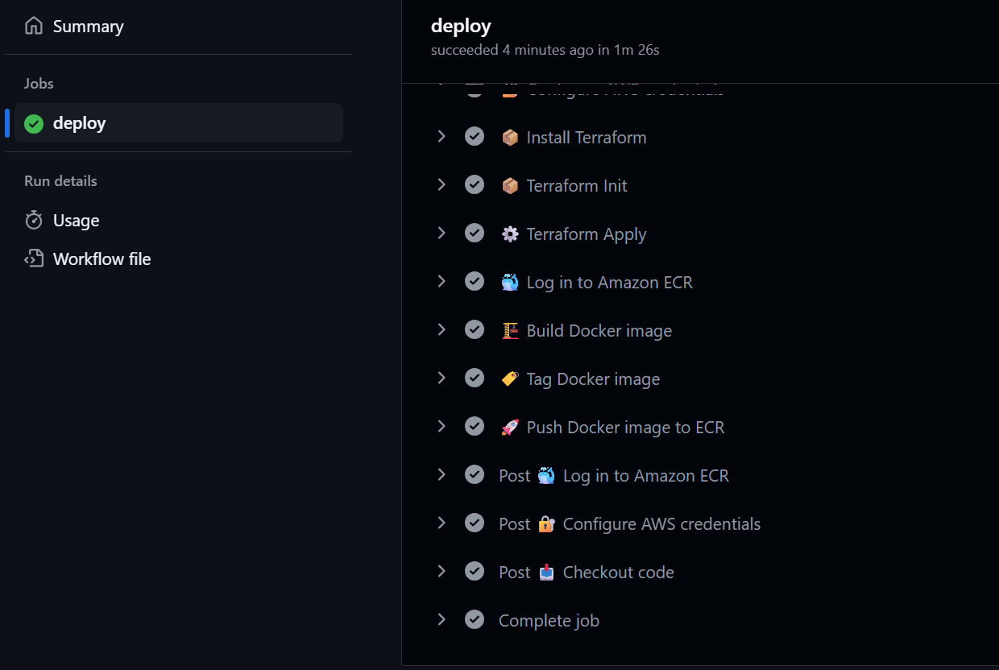

# Task 5: Docker + ECR + ECS Deployment
- Create a Dockerfile to containerize the React app.
- Build and push the Docker image to AWS ECR.
- Use Terraform to:
- Create an ECS Cluster and Service
- Deploy the Docker container on ECS
- Automate everything via GitHub Actions.

# Create a Dockerfile to containerize the React app.

# Build and push the Docker image to AWS ECR.

