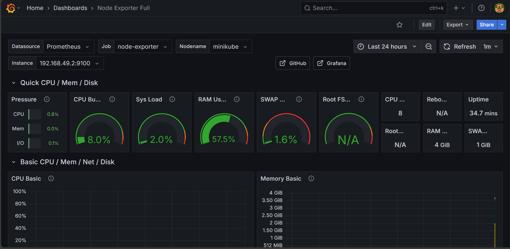

# Task 7: Monitoring Using Prometheus and Grafana
- Set up Prometheus and Grafana inside the Kubernetes cluster.
- Monitor:
  - Pod health
  - CPU and Memory usage
- Create Grafana dashboards based on Prometheus data.

